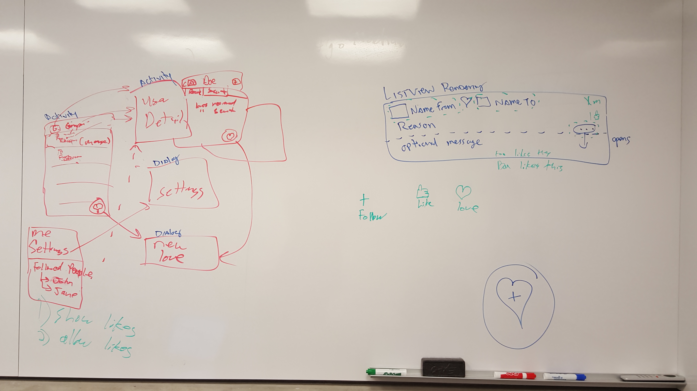

# Love Monster Unleashed

## Overview

Love Monster Unleashed is an Android client to the Love Monster web
application. It makes it easy to see recent loves, send love, and view
activity data for individual users. It is a fast, convenient, and fun
way to show appreciation to your friends, family, or co-workers.

Time Spent: **1** cumulative developer hours.

## Wireframes

## User Stories

The following **required** functionality is completed:

* [x] Display a page of the most recent loves, including To, From, and Reason
* [x] "Send Love" button that renders an activity that allows the user to
  select a receipient, specify the reason and optional longer message, then
  click Send to post the love to the API
* [x] Click on a user to render a user detail page, showing recently sent
  and received loves.
* [x] The user can click an icon representing themselves to see a
  rendering of their own activity.
* [x] Authentication with Okta

The following **optional** features are implemented:
* [x] display time ago and the optional message for a love
* [] Make the recipient form type-ahead based on the full userlist from LDAP
* [x] Infinite scrolling of loves, fetching more from the API
* [x] Swiping down refreshes the love list to include new loves
* [] Allow input and rendering of github emoticons like the main web app does
* [X] Render users' profile pictures
* [] Settings page to specify connection information that gets stored in
  User Preferences keystore
* [] Render the "likes" functionality, showing which users that like a particular love.
* [] Allow the user to Like a love.
* [] Add a dialog showing extra detail about a Love that allows extra activities (liking a love, showing the reason, etc)
* [] Ability to add your "favorite" people (icon on user detail, then shows up in hamburger menu under "Favorites" header). Stores this information in user preferences.

## Walkthrough

## Notes

## Open-source libraries used

- [Android Async HTTP](https://github.com/loopj/android-async-http) - Simple asynchronous HTTP requests with JSON parsing
- [Picasso](http://square.github.io/picasso/) - Image loading and caching library for Android
- [Icon Finder](https://www.iconfinder.com/icons/285645/user_icon) - Open Source Icons

## License

    Copyright 2015 Devin Breen, Anthony Caliendo, Ben Schmeckpeper

    Licensed under the Apache License, Version 2.0 (the "License");
    you may not use this file except in compliance with the License.
    You may obtain a copy of the License at

        http://www.apache.org/licenses/LICENSE-2.0

    Unless required by applicable law or agreed to in writing, software
    distributed under the License is distributed on an "AS IS" BASIS,
    WITHOUT WARRANTIES OR CONDITIONS OF ANY KIND, either express or implied.
    See the License for the specific language governing permissions and
    limitations under the License.
